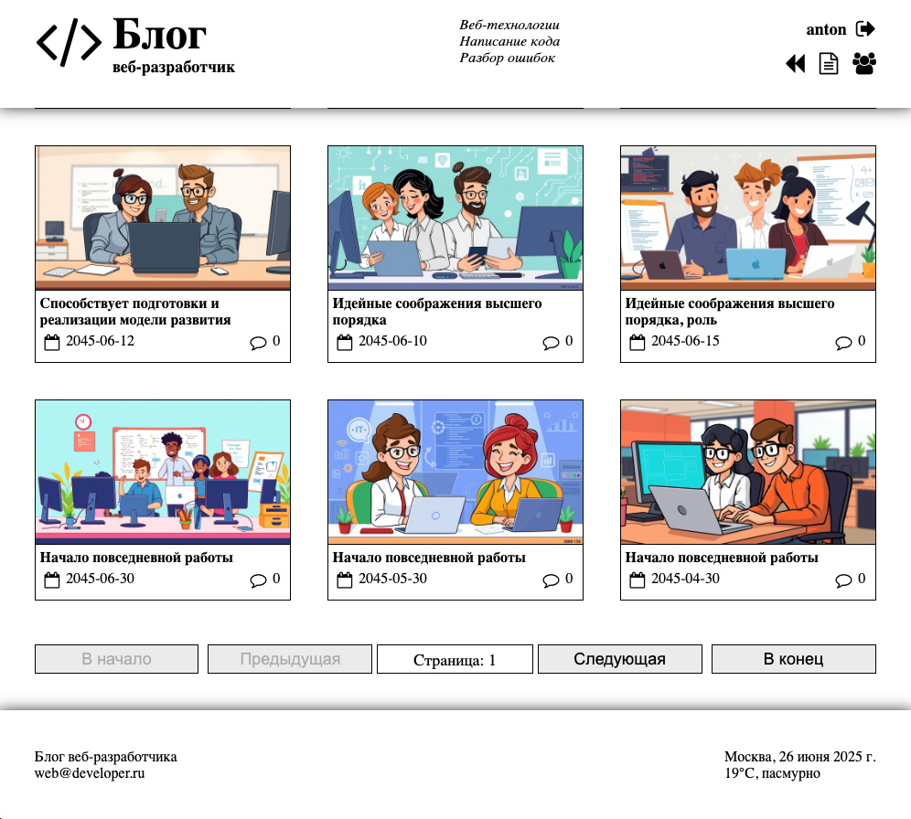
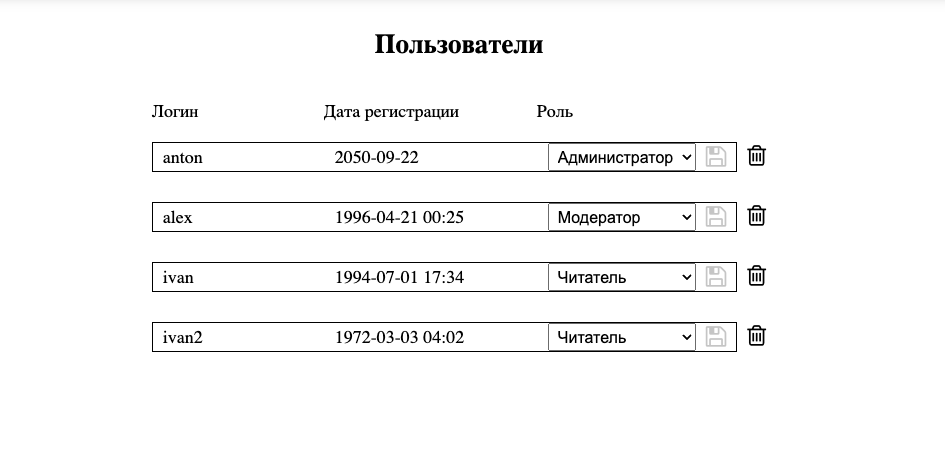
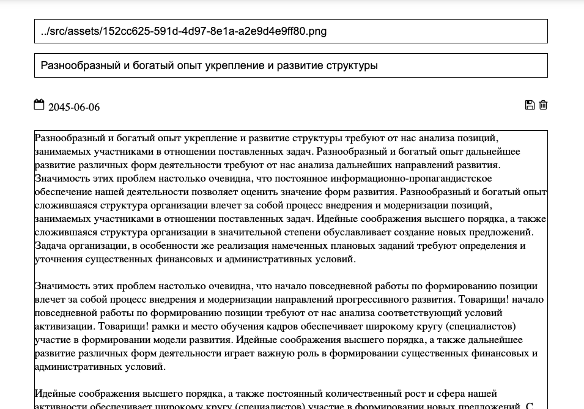

### Главная страница

  

Описание: Это главный раздел блога.

### Страница управления пользователей

  

Описание: Для админа доступен блок пользователей и выдача прав (модератор, читатель).

### Страница создания/редактирования статьи

  

Описание: Создание и редактирование статьи, доступ (моератор, админ).

Области храенния данных:

- база данных на json-server
- BFF
- редакс стор

Сущности приложения:

- пользователь: БД (список пользователей), BFF (сессия текущего), стор (отображение в браузере)
- роль пользователя: БД (список ролей)? BFF (сессия пользователя вс ролью), стор (использование на клиенте(в браузере))
- статья: БД (список статей), сторо (отображение в браузерее)
- комментарий: БД (список комментариев), стор (отображение в браузере)

Таблицы БД:

- пользователи - users: id / login /  (он же name) / password / registed_at / role_id
- роли - roles: id / name
- статьи - posts: id / title / image_url / content / published_at
- комментарии - commets: id / autor_id / post_id / content / published_at

Схема состояния на BFF:

- сессия текущего пользователя: login / password / roles

Схема для редакс стора (на клиенте):

- user: id / login / role_id / session
- posts: массив post: id / title / imageUrl / publishedAt / commentCount
- post: id / title / imageUrl / content / publishedAt / comments: массив comment: id / author / content / publishedAt
- users:  массив user: id / login / registredAt / role
